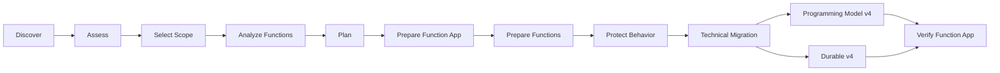

# Azure Functions Migration Skills

## Objetivo

Toolkit de Agent Skills para comprender, planificar, preparar, migrar y verificar Azure Function Apps Node.js hacia un
target técnico aprobado.

Target de campaña:

- Node.js 24;
- Azure Functions Runtime v4;
- Programming Model v4;
- dependencias compatibles según baseline aprobado;
- comportamiento observable protegido y verificable.

La migración técnica no exige modernización arquitectónica completa.

Los cambios estructurales se realizan únicamente cuando sean necesarios para completar o verificar de forma segura la
migración.

## Ejecución

La ejecución principal se realiza desde GitHub Copilot Chat dentro del repositorio objetivo.

Los artefactos también deben poder ser comprendidos y ejecutados:

- por otro agente compatible;
- manualmente por un developer.

No existe orquestación autónoma obligatoria.

El developer decide cuándo avanzar a la siguiente etapa.

## Principio

Trabajar desde evidencia hacia cambios.

Flujo conceptual:

```text
DISCOVER
→ ASSESS
→ SELECT SCOPE
→ ANALYZE
→ PLAN
→ PREPARE
→ TEST
→ MIGRATE
→ VERIFY
```

No todos los skills deben ejecutarse en todos los casos.

Una dimensión que ya cumple el target debe preservarse.

No modificar código únicamente para ajustarlo a una convención del toolkit.

## Policies compartidas

Fuente de verdad:

| Policy                           | Responsabilidad                                     |
|----------------------------------|-----------------------------------------------------|
| `_shared/security-policy.md`     | Qué contenido puede leerse, procesarse o producirse |
| `_shared/evidence-policy.md`     | Cómo sustentar hechos, inferencias e incertidumbres |
| `_shared/status-policy.md`       | Semántica común de estados                          |
| `_shared/architecture-policy.md` | Principios aplicables a cambios estructurales       |
| `_shared/lessons-policy.md`      | Aprendizaje gobernado desde ejecuciones reales      |

Las policies compartidas tienen prioridad sobre instrucciones locales contradictorias.

No duplicar sus reglas en los skills salvo cuando sea necesario referenciarlas.

## Dependency baseline

El baseline técnico vive en:

`_shared/dependency-baseline.json`

Responde:

`¿A qué target aprobado queremos llegar en esta campaña?`

No responde:

`¿Debe actualizarse esta dependencia en este repositorio?`

Ni:

`¿Cuál es la última versión disponible?`

El baseline:

- define el target técnico;
- contiene package targets aprobados;
- usa versiones reproducibles;
- no ejecuta upgrades;
- no sustituye assessment ni impact analysis;
- no se modifica automáticamente a partir de una migración exitosa.

Flujo:

```text
baseline
→ assessment
→ function analysis
→ plan
→ execution
→ verification
```

Las dependencias no conocidas permanecen inventariadas.

Cuando sea necesario investigar una dependencia no mapeada, utilizar evidencia oficial conforme a
`evidence-policy.md`.

Una nueva recomendación no se convierte automáticamente en target de campaña.

## Templates compartidos

Los templates Markdown definen vistas humanas.

Los JSON correspondientes son los contratos estructurados entre capabilities.

Templates:

```text
_shared/templates/
├── current-state.template.md
├── function-current-state.template.md
├── assessment.template.md
├── function-analysis.template.md
├── migration-plan.template.md
├── function-migration-plan.template.md
├── repository-preparation.template.md
├── function-preparation.template.md
├── function-migration.template.md
├── durable-migration.template.md
├── verification.template.md
└── shared-resources.template.md
```

`shared-resources.template.md` se utiliza únicamente cuando existan recursos compartidos confirmados.

No crear artifacts o documentos vacíos únicamente por simetría.

## Modelo documental

La migración conserva cuatro perspectivas:

```text
BEFORE
→ PLAN
→ EXECUTION
→ AFTER
```

### BEFORE

Describe el sistema original.

Owners principales:

```text
.migration/repository/inventory.json
.migration/catalog/current-state.md
.migration/catalog/functions/<FunctionName>.md
```

El catálogo BEFORE no debe reescribirse para representar el estado posterior a la migración.

### PLAN

Describe qué debe cambiar y por qué.

Owners principales:

```text
.migration/plans/migration-plan.json
.migration/functions/<FunctionName>/migration-plan.json
```

### EXECUTION

Registra qué se ejecutó realmente.

Owners principales:

```text
.migration/repository/preparation.json
.migration/functions/<FunctionName>/preparation.json
.migration/functions/<FunctionName>/migration.json
.migration/workflows/<WorkflowName>/durable-migration.json
```

### AFTER

Demuestra el resultado final.

Owner:

```text
.migration/verification/verification.json
```

## Flujo operativo



La generación dedicada de pruebas podrá ser realizada por `generate-function-tests` cuando esa capability sea
implementada.

Mientras no exista como skill operativo, ninguna etapa debe asumir silenciosamente responsabilidades que no pertenezcan
a su contrato.

## Skills operativos

| Skill                          | Pregunta principal                                                     | Modifica código    |
|--------------------------------|------------------------------------------------------------------------|--------------------|
| `discover-function-app`        | ¿Qué existe actualmente?                                               | No                 |
| `assess-function-app`          | ¿Qué gaps globales existen contra el target?                           | No                 |
| `analyze-function`             | ¿Qué implica migrar esta Function?                                     | No                 |
| `plan-function-migration`      | ¿Qué acciones coordinadas deben ejecutarse?                            | No                 |
| `prepare-function-app`         | ¿Qué preparación global aprobada necesita la Function App?             | Sí                 |
| `prepare-function`             | ¿Qué preparación estructural o de testabilidad necesita esta Function? | Sí                 |
| `migrate-programming-model-v4` | ¿Qué adaptación requiere el Azure adapter para PM v4?                  | Sí                 |
| `migrate-durable-functions-v4` | ¿Cómo migramos coherentemente este workflow Durable?                   | Sí                 |
| `verify-function-app`          | ¿La migración quedó demostrada?                                        | No corrige         |
| `review-skill-performance`     | ¿Qué debería evolucionar en el toolkit?                                | No automáticamente |

`review-skill-performance` está fuera del flujo operativo de migración.

## 1. discover-function-app

Pregunta:

`¿Qué existe actualmente?`

Produce:

```text
.migration/repository/inventory.json
.migration/catalog/current-state.md
```

Responsabilidades principales:

- detectar Function Apps;
- inventariar Functions;
- detectar triggers y bindings;
- registrar dependencias;
- detectar Node declarado;
- detectar Programming Model;
- detectar Durable;
- registrar nombres de configuration keys;
- detectar archivos protegidos sin leerlos;
- generar candidatos de recursos compartidos únicamente cuando exista señal determinista suficiente.

Discovery registra hechos observables.

No realiza assessment.

No planifica.

No modifica código.

## 2. assess-function-app

Pregunta:

`¿Qué tan lejos está globalmente esta Function App del target aprobado?`

Consume principalmente:

```text
inventory.json
current-state.md
dependency-baseline.json
```

Evalúa dimensiones como:

- Node.js;
- Azure Functions Runtime;
- Programming Model;
- Durable Functions;
- dependencias;
- TypeScript y tooling cuando corresponda;
- pruebas actuales;
- condiciones globales relevantes para la migración.

Produce:

```text
.migration/repository/assessment.json
.migration/repository/assessment.md
```

Assessment puede identificar dependencias que requieren investigación.

No modifica el baseline.

No analiza profundamente cada Function.

No planifica cambios concretos.

## 3. Selección de scope

El developer puede solicitar:

- una Function;
- varias Functions;
- una Function App completa.

El flujo diferencia:

```text
requestedScope
effectiveScope
affectedFunctionsOutsideScope
```

`requestedScope` representa exactamente lo seleccionado por el developer.

`effectiveScope` representa el mínimo scope técnicamente necesario para ejecutar una migración coherente.

Encontrar un consumidor fuera del scope no lo incorpora automáticamente a la migración.

### Durable

Cuando una Function seleccionada pertenece a un workflow Durable, el análisis o planificación puede determinar que el
workflow completo constituye la unidad mínima coherente.

La expansión debe quedar justificada y visible para el developer.

## 4. analyze-function

Pregunta:

`¿Qué implica migrar esta Function?`

Analiza únicamente el slice necesario.

Puede identificar:

- comportamiento observable;
- entradas y salidas;
- errores relevantes;
- efectos observables;
- configuración utilizada;
- dependencias internas y externas;
- Azure SDK usage;
- infraestructura;
- compatibilidad Node.js;
- impacto de Programming Model;
- rol Durable;
- testabilidad;
- acoplamiento legacy;
- recursos compartidos;
- consumidores fuera del scope.

Produce:

```text
.migration/functions/<FunctionName>/analysis.json
.migration/functions/<FunctionName>/analysis.md
```

También puede producir la ficha BEFORE cuando todavía no exista:

```text
.migration/catalog/functions/<FunctionName>.md
```

Analysis identifica necesidades.

No asigna acciones definitivas ni pasos de implementación.

No modifica código.

## 5. plan-function-migration

Pregunta:

`¿Qué debemos ejecutar y en qué orden?`

Consume:

```text
inventory
assessment
function analyses
dependency baseline
```

Determina:

- scope solicitado;
- scope efectivo;
- Functions afectadas fuera del scope;
- acciones globales;
- acciones sobre recursos compartidos;
- acciones por Function;
- dependencias entre acciones;
- orden de ejecución;
- acciones estructurales requeridas para migración;
- deuda u optimizaciones fuera de alcance;
- coordinación Durable.

Produce:

```text
.migration/plans/migration-plan.json
.migration/plans/migration-plan.md
```

y:

```text
.migration/functions/<FunctionName>/migration-plan.json
.migration/functions/<FunctionName>/migration-plan.md
```

Planning no:

- modifica código;
- investiga arbitrariamente versiones nuevas;
- redefine targets aprobados;
- moderniza el repositorio.

## Recursos compartidos

Discovery puede producir candidatos.

Analysis confirma uso por Function.

Planning consolida recursos compartidos cuando exista evidencia suficiente.

Artifacts condicionales:

```text
.migration/resources/shared-resources.json
.migration/resources/shared-resources.md
```

Un recurso compartido debe representar un recurso o implementación concreta.

Usar la misma tecnología o SDK no demuestra que dos Functions compartan el mismo recurso.

Cada recurso que requiera modificación debe tener una única acción propietaria.

IDs:

```text
SR-<TYPE>-<NAME>
SR-ACTION-NNN
```

Los consumidores dependen de la acción propietaria cuando corresponda.

## 6. prepare-function-app

Pregunta:

`¿Qué preparación global aprobada necesita la Function App?`

Ejecuta únicamente acciones globales o compartidas aprobadas por el plan.

Puede incluir cuando corresponda:

- runtime/tooling;
- dependencias aprobadas;
- TypeScript;
- Jest y configuración de pruebas;
- scripts;
- build configuration;
- configuración estructural;
- recursos compartidos globales.

Produce:

```text
.migration/repository/preparation.json
.migration/repository/preparation.md
```

No selecciona nuevas versiones.

No realiza el build global final.

## 7. prepare-function

Pregunta:

`¿Qué preparación mínima necesita esta Function antes de la migración técnica?`

Ejecuta únicamente cambios estructurales o de testabilidad aprobados.

Puede incluir cuando corresponda:

- separar responsabilidades necesarias del Azure adapter;
- introducir seams mínimos;
- aislar configuración;
- aislar una dependencia externa;
- adaptar consumidores a dependency upgrades ya planificados;
- introducir un boundary real;
- utilizar un Provider o Adapter temporal para código legacy.

No debe:

- modernizar todo el slice;
- reorganizar carpetas por estética;
- descomponer completamente servicios legacy;
- crear contratos sin responsabilidad real;
- introducir cambios `requiredForMigration: false`.

Produce:

```text
.migration/functions/<FunctionName>/preparation.json
.migration/functions/<FunctionName>/preparation.md
```

`prepare-function` habilita testabilidad cuando sea necesario.

La generación dedicada de pruebas pertenece a la capability de testing correspondiente.

## Protección del comportamiento

La migración debe preservar cuando corresponda:

```text
same input
same output
same relevant errors
same observable side effects
```

Preferir:

```text
comportamiento actual
→ caracterización cuando sea posible
→ seam mínimo cuando sea necesario
→ pruebas faltantes
→ baseline verde
→ migración técnica
→ mismos contratos verdes
```

Cuando una estructura legacy impida caracterizar el comportamiento antes de una extracción mínima:

- registrar la limitación;
- realizar únicamente el seam necesario;
- proteger después el comportamiento observable;
- no convertir la limitación en permiso para una refactorización amplia.

Las pruebas de aplicación utilizan Jest.

No agregar integration tests dentro del alcance actual.

## 8. migrate-programming-model-v4

Pregunta:

`¿Cómo adaptamos el Azure adapter a Programming Model v4?`

Consume el plan y la preparación existentes.

La versión objetivo de `@azure/functions` debe provenir del baseline y del plan aprobado.

Responsabilidad principal:

- adaptar registro;
- trigger;
- bindings;
- Azure Functions APIs;
- adapter específico del runtime.

No vuelve a realizar preparación estructural.

No selecciona versiones.

No ejecuta el build global final.

Produce:

```text
.migration/functions/<FunctionName>/migration.json
.migration/functions/<FunctionName>/migration.md
```

Si la Function ya satisface Programming Model v4:

```text
NOT_APPLICABLE
```

## 9. migrate-durable-functions-v4

Pregunta:

`¿Cómo migramos este workflow Durable como una unidad coherente?`

Consume el plan y los análisis de las Functions participantes.

La versión objetivo de `durable-functions` debe provenir del baseline y del plan aprobado.

Debe preservar cuando corresponda:

- workflow topology;
- decisions;
- Activities;
- retries;
- timers;
- external events;
- sub-orchestrations;
- outputs;
- error semantics;
- determinism.

Las instancias Durable potencialmente activas requieren tratamiento explícito cuando la seguridad de replay no pueda
demostrarse.

Produce:

```text
.migration/workflows/<WorkflowName>/durable-migration.json
.migration/workflows/<WorkflowName>/durable-migration.md
```

El workflow no se representa como una Function ficticia.

## 10. verify-function-app

Pregunta:

`¿La migración técnica quedó demostrada?`

Verification compara:

```text
BEFORE
→ PLAN
→ AFTER
```

Verifica cuando corresponda:

- Node.js utilizado;
- Azure Functions Runtime;
- dependency targets;
- instalación;
- typecheck;
- build global;
- pruebas;
- cobertura;
- contratos observables;
- Functions registradas;
- Programming Model;
- Durable;
- acciones requeridas del plan;
- estructura requerida por el plan;
- recursos compartidos;
- legacy residual relevante;
- packaging.

Produce:

```text
.migration/verification/verification.json
.migration/verification/verification.md
```

Verification:

```text
VERIFY != FIX
```

No debe corregir automáticamente los fallos encontrados.

Un resultado de build exitoso no demuestra por sí solo preservación funcional.

La deuda no bloqueante puede producir:

```text
VERIFIED_WITH_DEBT
```

Las mejoras con:

```text
requiredForMigration: false
```

no impiden cerrar una migración técnica.

## Build

El build global final pertenece a:

`verify-function-app`

No ejecutar el build global como gate obligatorio después de cada Function.

Durante preparation y migration pueden utilizarse validaciones selectivas como:

- pruebas relevantes;
- typecheck selectivo;
- static analysis;
- checks deterministas.

Esto evita falsos fallos intermedios cuando existen varias Functions pendientes de adaptación dentro de la misma
Function App.

## Arquitectura

Fuente de verdad:

`_shared/architecture-policy.md`

La migración técnica no exige que el repositorio alcance una arquitectura ideal.

Preservar las convenciones existentes cuando sean coherentes.

Aplicar cambios estructurales únicamente cuando una acción aprobada los requiera.

Todo cambio estructural debe distinguir entre:

```text
requiredForMigration: true
requiredForMigration: false
```

Solo los cambios requeridos para migración forman parte obligatoria de la ejecución técnica.

## Estados

Fuente de verdad:

`_shared/status-policy.md`

La policy define:

```text
evidenceStatus
actionStatus
executionStatus
artifact status
verification checks
final verification status
```

No redefinir enums localmente en este README ni en los skills.

## IDs

IDs de acciones:

```text
GLOBAL-NNN
FN-<FUNCTION>-NNN
SR-ACTION-NNN
```

IDs de recursos compartidos:

```text
SR-<TYPE>-<NAME>
```

`REQ-*` está deprecado para nuevas acciones.

No utilizar UUIDs o hashes para acciones en el MVP.

## Estructura de `.migration`

Crear incrementalmente:

```text
.migration/
├── catalog/
│   ├── current-state.md
│   └── functions/
│       └── <FunctionName>.md
├── repository/
│   ├── inventory.json
│   ├── assessment.json
│   ├── assessment.md
│   ├── preparation.json
│   └── preparation.md
├── resources/
│   ├── shared-resources.json
│   └── shared-resources.md
├── functions/
│   └── <FunctionName>/
│       ├── analysis.json
│       ├── analysis.md
│       ├── migration-plan.json
│       ├── migration-plan.md
│       ├── preparation.json
│       ├── preparation.md
│       ├── migration.json
│       └── migration.md
├── workflows/
│   └── <WorkflowName>/
│       ├── durable-migration.json
│       └── durable-migration.md
├── plans/
│   ├── migration-plan.json
│   └── migration-plan.md
├── verification/
│   ├── verification.json
│   └── verification.md
└── lessons/
```

Crear únicamente las carpetas que correspondan.

`resources/` existe únicamente cuando haya recursos compartidos confirmados.

`workflows/` existe únicamente cuando existan workflows Durable.

No crear carpetas vacías.

## Ownership de información

| Información                                       | Owner                                 |
|---------------------------------------------------|---------------------------------------|
| Functions y dependencias existentes               | `inventory.json`                      |
| Catálogo humano BEFORE                            | `catalog/**`                          |
| Gap global                                        | `assessment.json`                     |
| Dependency classification                         | `assessment.json`                     |
| Dependency target aprobado                        | `_shared/dependency-baseline.json`    |
| Comportamiento e impacto por Function             | `analysis.json`                       |
| Necesidades estructurales o técnicas por Function | `analysis.json`                       |
| Shared resources consolidados                     | `shared-resources.json`               |
| Acciones globales y coordinación                  | global `migration-plan.json`          |
| Acciones aprobadas por Function                   | Function `migration-plan.json`        |
| Preparación global ejecutada                      | `repository/preparation.json`         |
| Preparación estructural ejecutada                 | Function `preparation.json`           |
| Migración técnica ejecutada                       | Function `migration.json`             |
| Migración Durable ejecutada                       | `workflows/**/durable-migration.json` |
| Resultado final                                   | `verification.json`                   |
| Aprendizaje de ejecución                          | lessons / `review-skill-performance`  |

Referenciar al owner.

No duplicar información completa sin necesidad.

## Invalidación

Regenerar únicamente el artifact cuya entrada relevante haya cambiado.

Ejemplos conceptuales:

```text
estructura o Functions cambian
→ rediscover

target o dependency baseline cambia
→ reassess

slice o dependency impact cambia
→ reanalyze

acciones, ownership o scope cambian
→ replan

sistema cambia después de verification
→ reverify
```

No implementar checksums ni una state machine compleja en el MVP.

Los artifacts históricos BEFORE no deben reescribirse para representar AFTER.

## Seguridad

Fuente de verdad:

`_shared/security-policy.md`

La policy aplica antes de cualquier discovery, analysis, planning, preparation, migration o verification.

Regla:

```text
detect
→ exclude
→ never read protected content
```

Detectar la existencia de un archivo protegido no autoriza inspeccionarlo.

Ningún skill, agente o script puede saltarse esta policy para completar automáticamente una validación.

## Scripts internos

Los scripts internos deben funcionar con Node.js 14 o superior.

Su runtime es independiente del runtime objetivo de la Function App.

Mantener un script dentro de un skill cuando solo ese skill lo utilice.

Promover tooling a shared únicamente cuando exista reuse real.

Los scripts son herramientas internas del toolkit.

No constituyen una CLI pública.

## Economía de contexto

Preferir este orden:

```text
existing artifacts
→ deterministic tools
→ selective source inspection
→ broader repository inspection only when necessary
```

Preferir:

- referencias por ID;
- source slices;
- artefactos estructurados;
- análisis por Function;
- resultados deterministas;
- conocimiento aprobado existente.

Evitar:

- releer todo el repositorio;
- cargar todos los analyses cuando solo se necesita uno;
- investigar dependencias irrelevantes;
- repetir evidencia ya disponible;
- duplicar información cuyo owner ya existe.

## Mejora del toolkit

`review-skill-performance` está fuera del flujo operativo.

Puede consumir:

- lessons;
- findings;
- failures;
- verification;
- eval results.

Puede proponer:

- evolución de un skill;
- evolución de scripts;
- nuevos evals;
- simplificaciones;
- correcciones de policies o templates;
- actualización controlada del dependency baseline.

Nunca modifica automáticamente el toolkit.

Flujo:

```text
execution
→ observation
→ proposal
→ review-skill-performance
→ human review
→ approved change
→ evals
```

Una ejecución exitosa no convierte automáticamente una recomendación en estándar permanente.

## Uso rápido con GitHub Copilot Chat

### Discovery

```text
Usa el skill discover-function-app.

Trabaja desde la raíz actual.

Respeta security-policy.md antes de leer cualquier archivo.

Genera únicamente los artifacts definidos por el skill.
```

### Assessment

```text
Usa assess-function-app.

Consume los artifacts existentes en .migration.

Evalúa la Function App contra el target aprobado de dependency-baseline.json.

No modifiques código.
```

### Análisis de una Function

```text
Usa analyze-function para RequestReport.

Consume inventory, assessment y el catálogo BEFORE.

Analiza únicamente el slice necesario.

No modifiques código.
```

### Planning

```text
Usa plan-function-migration.

Consume inventory, assessment y los analyses requeridos.

Determina requestedScope, effectiveScope y affectedFunctionsOutsideScope.

Consolida shared resources cuando corresponda.

Genera el plan global y los planes por Function.

No modifiques código.
```

### Preparación global

```text
Usa prepare-function-app.

Ejecuta únicamente las acciones GLOBAL-* y SR-ACTION-* aprobadas por el plan.

No selecciones nuevas versiones.

No ejecutes todavía el build global final.
```

### Preparación de Function

```text
Usa prepare-function para RequestReport.

Ejecuta únicamente las acciones FN-* aprobadas con requiredForMigration=true que correspondan a preparation.

Preserva comportamiento observable.

No realices modernización adicional.
```

### Programming Model v4

```text
Usa migrate-programming-model-v4 para RequestReport.

Consume plan y preparation existentes.

Migra únicamente las responsabilidades técnicas del Azure adapter que correspondan.

No realices refactorización adicional.
```

### Durable

```text
Usa migrate-durable-functions-v4 para GenerateReportWorkflow.

Trata el workflow como una unidad coherente.

Preserva comportamiento y determinismo.

No asumas seguridad de replay de instancias activas sin evidencia.
```

### Verification

```text
Usa verify-function-app.

Compara BEFORE, PLAN y AFTER.

Ejecuta los gates finales.

Verifica contratos observables y acciones requeridas.

No corrijas automáticamente los fallos.
```

### Mejora del toolkit

```text
Usa review-skill-performance.

Revisa lessons, verification, failures y evals disponibles.

Propón evoluciones mínimas basadas en evidencia.

No modifiques automáticamente skills, policies, templates ni dependency-baseline.json.
```

## Regla de trabajo

Interacción recomendada:

```text
skill
→ artifact
→ revisión del developer
→ siguiente skill
```

GitHub Copilot Chat es el punto principal de interacción.

Los scripts internos son herramientas deterministas del skill.

El toolkit debe buscar el menor cambio suficiente para alcanzar el target técnico con:

- evidencia;
- seguridad;
- trazabilidad;
- comportamiento preservado;
- targets reproducibles;
- ownership claro;
- recursos compartidos coordinados;
- verificación reproducible;
- mínima complejidad accidental.
