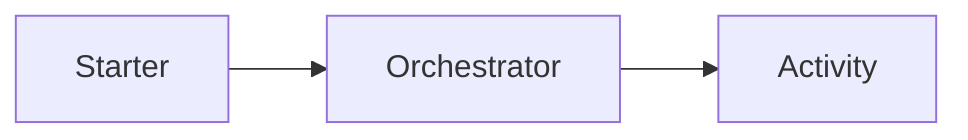

# Migración Durable — <WorkflowName>

## Objetivo

Registrar la migración técnica coordinada del workflow Durable `<WorkflowName>`.

## Referencias

Plan global:

`.migration/plans/migration-plan.md`

Planes de Functions participantes:

-

## Estado

`MIGRATED | NOT_APPLICABLE | BLOCKED | REQUIRES_REVIEW`

## Workflow

### Participantes

| Function | Rol |
|----------|-----|
|          |     |

Roles posibles:

- `CLIENT`
- `STARTER`
- `ORCHESTRATOR`
- `ACTIVITY`
- `SUB_ORCHESTRATOR`
- `ENTITY`

## Grafo

Incluir el diagrama únicamente si mejora la comprensión.

Si la topología cambió mediante una acción aprobada, representar BEFORE y AFTER.

No duplicar diagramas cuando las relaciones entre participantes se preservaron.

## Comportamiento preservado

Registrar únicamente los elementos que realmente existan:

- orden;
- decisiones;
- Activities;
- retries;
- timers;
- events;
- sub-orchestrations;
- outputs;
- errores.

No modificar lógica funcional como parte de la migración Durable salvo que exista una acción aprobada que lo requiera.

## Integración técnica

### Durable Functions y APIs

| Elemento | Antes | Después | Adaptación realizada |
|----------|-------|---------|----------------------|
|          |       |         |                      |

Registrar únicamente paquetes o APIs realmente modificados.

No volver a resolver versiones target en esta etapa.

### Integración con runtime

Cambios realizados:

-

### Lógica funcional

Resultado:

`PRESERVED | CHANGED | REQUIRES_REVIEW`

Si existe `CHANGED`, debe corresponder a una acción aprobada y documentarse su impacto sobre el comportamiento
observable.

## Recursos compartidos

| Resource ID | Consumidores | Estado |
|-------------|--------------|--------|
|             |              |        |

No duplicar ni modificar recursos compartidos fuera de las acciones aprobadas.

## Determinismo

Resultado:

`PASS | FAIL | REQUIRES_REVIEW`

Evidencia:

-

Observaciones:

-

No afirmar `PASS` únicamente porque el código compile.

## Retries

| Uso | Antes | Después |
|-----|-------|---------|
|     |       |         |

Si no aplica:

`NOT_APPLICABLE`

## Timers

-

Si no aplica:

`NOT_APPLICABLE`

## Eventos externos

-

Si no aplica:

`NOT_APPLICABLE`

## Sub-orchestrators

-

Si no aplica:

`NOT_APPLICABLE`

## Entities

-

Si no aplica:

`NOT_APPLICABLE`

## Instancias activas

Estado:

`UNKNOWN | REVIEWED | NOT_APPLICABLE`

Riesgos:

-

No afirmar seguridad de replay productivo sin evidencia.

Si existen instancias potencialmente activas y la compatibilidad de replay permanece `UNKNOWN`, la migración requiere
revisión antes de asumir seguridad para despliegue productivo.

## Pruebas

| Suite | Resultado | Evidencia |
|-------|-----------|-----------|
|       |           |           |

Estados aplicables:

- `PASS`
- `FAIL`
- `NOT_EXECUTED`
- `NOT_APPLICABLE`
- `REQUIRES_REVIEW`

## Validaciones

| Validación | Resultado | Evidencia |
|------------|-----------|-----------|
|            |           |           |

No afirmar `PASS` sin evidencia.

## Archivos modificados

-

## Desviaciones del plan

-

Registrar únicamente diferencias entre la migración Durable planificada y la realmente ejecutada.

No introducir rediseño del workflow desde esta sección.

## Riesgos

-

## Incertidumbres

-

## Resultado

El workflow:

`se migró / no aplicaba / quedó bloqueado / requiere revisión`.
