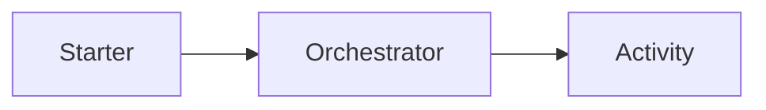

# Migración Durable — <WorkflowName>

## Objetivo

Registrar la migración coordinada del workflow Durable `<WorkflowName>`.

## Referencias

Plan global:

`.migration/plans/migration-plan.md`

Planes de Functions participantes:

-

## Estado

`MIGRATED | NOT_APPLICABLE | BLOCKED | REQUIRES_REVIEW`

## Workflow

### Participantes

| Function | Rol |
|----------|-----|
|          |     |

Roles posibles:

- `CLIENT`
- `STARTER`
- `ORCHESTRATOR`
- `ACTIVITY`
- `SUB_ORCHESTRATOR`
- `ENTITY`

## Grafo

Incluir el diagrama únicamente si mejora la comprensión.

## Comportamiento preservado

Registrar únicamente los elementos que realmente existan:

- orden;
- decisiones;
- Activities;
- retries;
- timers;
- events;
- sub-orchestrations;
- outputs;
- errores.

## Arquitectura

### Runtime integration

Cambios realizados:

-

### Capability logic

Resultado:

`PRESERVED | CHANGED | REQUIRES_REVIEW`

## Recursos compartidos

| Resource ID | Consumidores | Estado |
|-------------|--------------|--------|
|             |              |        |

## Determinismo

Resultado:

`PASS | FAIL | REQUIRES_REVIEW`

Observaciones:

-

## Retries

| Uso | Antes | Después |
|-----|-------|---------|
|     |       |         |

Si no aplica:

`NOT_APPLICABLE`

## Timers

-

Si no aplica:

`NOT_APPLICABLE`

## External Events

-

Si no aplica:

`NOT_APPLICABLE`

## Sub-orchestrators

-

Si no aplica:

`NOT_APPLICABLE`

## Entities

-

Si no aplica:

`NOT_APPLICABLE`

## Instancias activas

Estado:

`UNKNOWN | REVIEWED | NOT_APPLICABLE`

Riesgos:

-

No afirmar seguridad de replay productivo sin evidencia.

## Tests

| Suite | Resultado |
|-------|-----------|
|       |           |

## Validaciones

-

## Riesgos

-

## Unknowns

-

## Resultado

El workflow:

`se migró / no aplicaba / quedó bloqueado / requiere revisión`.
