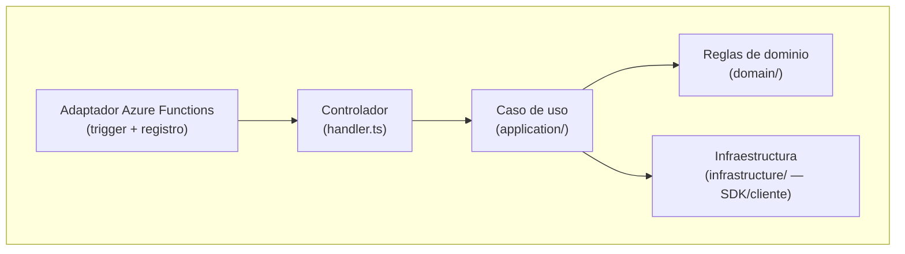
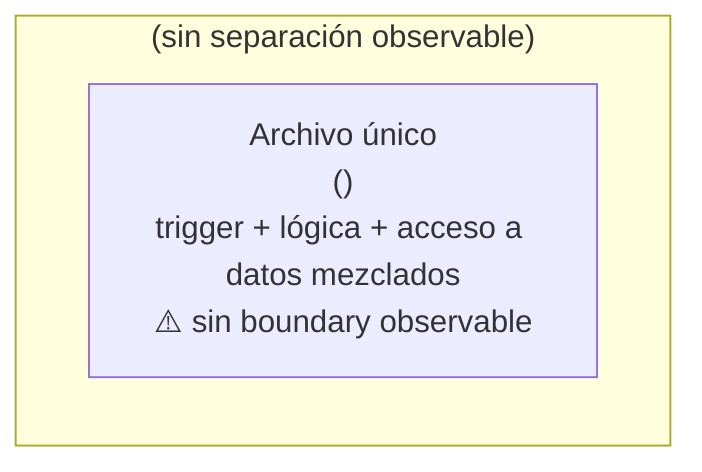

# Arquitectura observable y diagramas

Cargar esta referencia al momento de documentar la sección "Arquitectura observable" de `current-state.md`, incluyendo cuándo y cómo generar diagramas.

## Qué describir

Describir sin puntuar:

- entrypoints;
- ubicación de lógica funcional;
- adapters o composition roots existentes;
- módulos/capabilities observables;
- infraestructura compartida observable;
- acoplamiento directo al runtime cuando sea evidente.

No comparar todavía contra arquitectura target.

## Diagrama de flujo entre Functions

Cuando sea útil, incluir un diagrama Mermaid `flowchart` con nodos principales: triggers, Functions, orchestrator/activities, capabilities, shared resources y external resources candidatos. Usar enlaces sólidos solo para relaciones `CONFIRMED`; usar enlaces punteados para relaciones `INFERRED`. Este diagrama documenta el **flujo entre Functions** (quién dispara a quién), no la organización interna de una capability.

## Diagrama de capas (organización interna)

Además del diagrama de flujo, cuando exista evidencia suficiente de la estructura interna de al menos una capability representativa, incluir un segundo diagrama Mermaid `flowchart` compacto que muestre esa composición por capas para 1-2 capabilities representativas, no todas. Este diagrama documenta **cómo está organizado el código dentro de una capability**, complementando (no reemplazando) el diagrama de flujo entre Functions.

### Caso 1 — capability con separación clara (adapter → handler → application → domain → infrastructure)

### Caso 2 — código legacy o sin separación observable

Muchos repositorios objetivo son legacy o tienen arquitectura deficiente: un único archivo puede concentrar trigger, validación, lógica de negocio y llamadas directas a un SDK, sin carpetas `application/`/`domain/`/`infrastructure/` observables. **Revelar esa falta de separación es tan valioso como documentar una estructura limpia** — no es un fallo de discovery, es evidencia crítica para `analyze-function` y para dimensionar el esfuerzo de migración/refactor.

En ese caso, el diagrama debe reflejar la realidad observada, no idealizarla:

Acompañar el diagrama con una nota textual explícita, por ejemplo: *"No se detectaron carpetas `application/`/`domain/` para esta capability; el archivo `<archivo>` concentra trigger, lógica de negocio y acceso a datos sin separación visible (evidencia: listado de archivos de la capability)."*

Señales que justifican usar el Caso 2 en lugar del Caso 1:

- la capability tiene 1 solo archivo relevante (además del test), sin subcarpetas `application/`, `domain/` o `infrastructure/`;
- el archivo del trigger contiene llamadas directas a un SDK externo (Cosmos, Service Bus, HTTP client, etc.) sin un repository/publisher/adapter intermedio;
- no hay separación observable entre validación, lógica de negocio y persistencia dentro del mismo archivo.

No hay obligación de elegir un único caso por todo el repositorio: cada capability puede documentarse con el caso que corresponda a su evidencia real. Un repositorio puede mostrar capabilities en Caso 1 y otras en Caso 2 simultáneamente.

## Idioma del artifact

`current-state.md` está dirigido a lectores humanos, no solo al toolkit. Usar español simple y claro en los labels y prosa, explicando el término técnico en inglés entre paréntesis cuando se use por primera vez (ej. "Puntos de entrada de Azure (adapters)", "Controlador (handler)"). Mantener sin traducir los nombres literales de archivos, carpetas, packages y estados de evidencia (`CONFIRMED`/`INFERRED`/`UNKNOWN`), agregando una leyenda breve al inicio del documento que explique esos estados en español.
