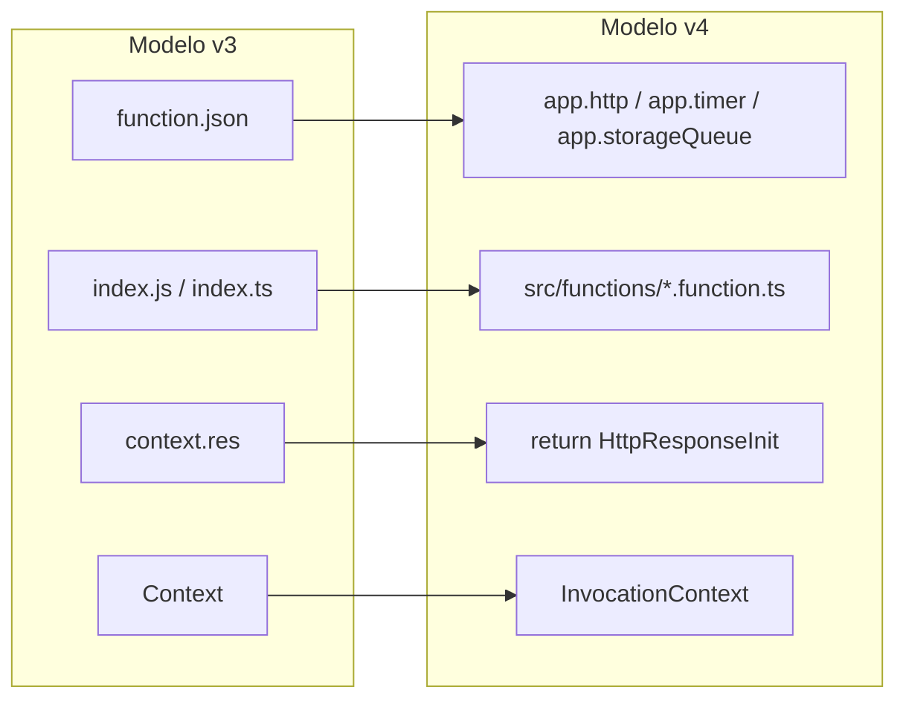

# 1. Migracion de Azure Functions v3 a v4

La migracion de modelo v3 a modelo v4 debe hacerse antes de la reestructura. El objetivo inicial no es mejorar arquitectura, sino conservar el comportamiento observable: misma ruta, mismo trigger, mismos status codes, mismos eventos y mismos efectos externos.

## Como reconocer una funcion legacy

Una funcion legacy suele tener esta estructura:

```text
CreateEntity/
├── function.json
└── index.js
```

Senales comunes:

- Existe `function.json`.
- El handler se exporta desde `index.js` o `index.ts`.
- HTTP responde con `context.res`.
- Se usan `Context`, `AzureFunction`, `context.log` o `context.done`.
- Validacion, reglas, configuracion, Cosmos, Service Bus y respuesta viven en el mismo archivo.

## Que identificar antes de tocar codigo

```text
Trigger:        HTTP / Queue / Timer / Blob / Cosmos / Durable
Entrada:        body / query / headers / queue message
Salida:         HTTP response / evento / documento / blob
Status codes:   200 / 201 / 202 / 400 / 404 / 409 / 500
Variables:      process.env.*
SDKs:           Cosmos / Service Bus / Blob / HTTP clients
Reglas:         validaciones, estados, calculos, idempotencia
Errores:        errores esperados e inesperados
Consumidores:   clientes HTTP, colas, topics, procesos aguas abajo
```

## Ejemplo legacy mejorado

Este ejemplo es intencionalmente monolitico. Muestra una funcion realista donde se mezclan HTTP, idempotencia, Cosmos, Service Bus, configuracion, fechas, errores y respuesta.

`function.json`:

```json
{
  "bindings": [
    {
      "authLevel": "function",
      "type": "httpTrigger",
      "direction": "in",
      "name": "req",
      "methods": ["post"],
      "route": "entities"
    },
    {
      "type": "http",
      "direction": "out",
      "name": "res"
    }
  ]
}
```

`index.js`:

```js
const crypto = require("node:crypto");
const {CosmosClient} = require("@azure/cosmos");
const {ServiceBusClient} = require("@azure/service-bus");

module.exports = async function (context, req) {
  try {
    const idempotencyKey = req.headers["x-idempotency-key"];
    const body = req.body;

    if (!idempotencyKey || !idempotencyKey.trim()) {
      context.res = {
        status: 400,
        body: {
          code: "INVALID_REQUEST",
          message: "x-idempotency-key header is required"
        }
      };
      return;
    }

    if (!body || !body.customerId || !body.name || !Array.isArray(body.items)) {
      context.res = {
        status: 400,
        body: {
          code: "INVALID_REQUEST",
          message: "customerId, name and items are required"
        }
      };
      return;
    }

    let total = 0;

    for (const item of body.items) {
      if (!item.sku || item.quantity <= 0 || item.unitPrice < 0) {
        context.res = {
          status: 400,
          body: {
            code: "INVALID_REQUEST",
            message: "items contain invalid values"
          }
        };
        return;
      }

      total += item.quantity * item.unitPrice;
    }

    const cosmosClient = new CosmosClient({
      endpoint: process.env.COSMOS_ENDPOINT,
      key: process.env.COSMOS_KEY
    });

    const container = cosmosClient
      .database(process.env.COSMOS_DATABASE)
      .container(process.env.COSMOS_ENTITIES_CONTAINER);

    const requestHash = crypto
      .createHash("sha256")
      .update(JSON.stringify({
        customerId: body.customerId,
        name: body.name,
        items: body.items
      }))
      .digest("hex");

    const existingResponse = await container.items.query({
      query: "SELECT TOP 1 * FROM c WHERE c.idempotencyKey = @idempotencyKey",
      parameters: [{
        name: "@idempotencyKey",
        value: idempotencyKey
      }]
    }).fetchAll();

    const existing = existingResponse.resources[0];

    if (existing) {
      if (existing.requestHash !== requestHash) {
        context.res = {
          status: 409,
          body: {
            code: "IDEMPOTENCY_CONFLICT",
            message: "idempotency key was already used with a different request"
          }
        };
        return;
      }

      context.res = {
        status: 200,
        body: {
          entityId: existing.entityId,
          status: existing.status,
          total: existing.total
        }
      };
      return;
    }

    const entityId = crypto.randomUUID();
    const createdAt = new Date().toISOString();

    await container.items.create({
      id: entityId,
      entityId,
      customerId: body.customerId,
      name: body.name.trim(),
      items: body.items,
      total,
      status: "CREATED",
      createdAt,
      idempotencyKey,
      requestHash
    });

    const serviceBusClient = new ServiceBusClient(process.env.SERVICE_BUS_CONNECTION);
    const sender = serviceBusClient.createSender(process.env.SERVICE_BUS_ENTITY_CREATED_QUEUE);

    await sender.sendMessages({
      body: {
        eventId: `${entityId}:EntityCreated`,
        eventType: "EntityCreated",
        entityId,
        occurredAt: createdAt
      }
    });

    await sender.close();
    await serviceBusClient.close();

    context.res = {
      status: 201,
      body: {
        entityId,
        status: "CREATED",
        total
      }
    };
  } catch (error) {
    context.log.error("Unexpected error creating entity", error);

    context.res = {
      status: 500,
      body: {
        code: "INTERNAL_ERROR",
        message: "Unable to create entity"
      }
    };
  }
};
```

## Problemas del ejemplo legacy

- El trigger conoce reglas de negocio.
- La idempotencia esta mezclada con HTTP y Cosmos.
- El calculo de `total` no se puede probar sin ejecutar la funcion.
- Cosmos y Service Bus estan acoplados al handler.
- Publicar evento despues de guardar puede dejar inconsistencias si falla Service Bus.
- La funcion crea clientes en cada ejecucion.
- Cualquier migracion futura exige tocar todo el archivo.

## Migracion minima a modelo v4

La primera version v4 conserva la logica monolitica. Todavia no es el objetivo final; solo cambia el modelo de programacion.

```ts
import crypto from "node:crypto";

import {CosmosClient} from "@azure/cosmos";
import {ServiceBusClient} from "@azure/service-bus";
import {app, HttpRequest, HttpResponseInit, InvocationContext} from "@azure/functions";

async function createEntity(
  request: HttpRequest,
  context: InvocationContext
): Promise<HttpResponseInit> {
  try {
    const idempotencyKey = request.headers.get("x-idempotency-key");
    const body = await request.json() as {
      customerId?: string;
      name?: string;
      items?: Array<{ sku: string; quantity: number; unitPrice: number }>;
    };

    if (!idempotencyKey?.trim()) {
      return {
        status: 400,
        jsonBody: {
          code: "INVALID_REQUEST",
          message: "x-idempotency-key header is required"
        }
      };
    }

    if (!body.customerId || !body.name || !Array.isArray(body.items)) {
      return {
        status: 400,
        jsonBody: {
          code: "INVALID_REQUEST",
          message: "customerId, name and items are required"
        }
      };
    }

    let total = 0;

    for (const item of body.items) {
      total += item.quantity * item.unitPrice;
    }

    const cosmosClient = new CosmosClient({
      endpoint: process.env.COSMOS_ENDPOINT!,
      key: process.env.COSMOS_KEY!
    });

    const container = cosmosClient
      .database(process.env.COSMOS_DATABASE!)
      .container(process.env.COSMOS_ENTITIES_CONTAINER!);

    const requestHash = crypto
      .createHash("sha256")
      .update(JSON.stringify({
        customerId: body.customerId,
        name: body.name,
        items: body.items
      }))
      .digest("hex");

    const existingResponse = await container.items.query({
      query: "SELECT TOP 1 * FROM c WHERE c.idempotencyKey = @idempotencyKey",
      parameters: [{
        name: "@idempotencyKey",
        value: idempotencyKey
      }]
    }).fetchAll();

    const existing = existingResponse.resources[0];

    if (existing) {
      if (existing.requestHash !== requestHash) {
        return {
          status: 409,
          jsonBody: {
            code: "IDEMPOTENCY_CONFLICT",
            message: "idempotency key was already used with a different request"
          }
        };
      }

      return {
        status: 200,
        jsonBody: {
          entityId: existing.entityId,
          status: existing.status,
          total: existing.total
        }
      };
    }

    const entityId = crypto.randomUUID();
    const createdAt = new Date().toISOString();

    await container.items.create({
      id: entityId,
      entityId,
      customerId: body.customerId,
      name: body.name.trim(),
      items: body.items,
      total,
      status: "CREATED",
      createdAt,
      idempotencyKey,
      requestHash
    });

    const serviceBusClient = new ServiceBusClient(process.env.SERVICE_BUS_CONNECTION!);
    const sender = serviceBusClient.createSender(process.env.SERVICE_BUS_ENTITY_CREATED_QUEUE!);

    await sender.sendMessages({
      body: {
        eventId: `${entityId}:EntityCreated`,
        eventType: "EntityCreated",
        entityId,
        occurredAt: createdAt
      }
    });

    await sender.close();
    await serviceBusClient.close();

    return {
      status: 201,
      jsonBody: {
        entityId,
        status: "CREATED",
        total
      }
    };
  } catch (error: unknown) {
    context.error("Unexpected error creating entity", error);

    return {
      status: 500,
      jsonBody: {
        code: "INTERNAL_ERROR",
        message: "Unable to create entity"
      }
    };
  }
}

app.http("CreateEntity", {
  methods: ["POST"],
  route: "entities",
  authLevel: "function",
  handler: createEntity
});
```

## Equivalencias v3 -> v4



## Checklist de migracion v3 -> v4

- Mantener ruta HTTP, metodos y `authLevel`.
- Mantener nombres de queues, topics, timers o triggers.
- Mantener variables de entorno.
- Mantener status codes y body de respuesta.
- Mantener eventos o documentos generados.
- Mantener manejo de errores esperado.
- No introducir refactors grandes en esta fase.
