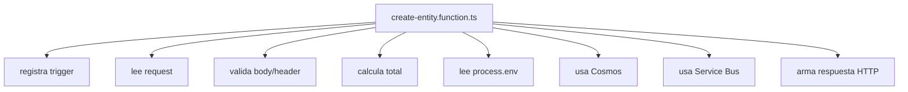
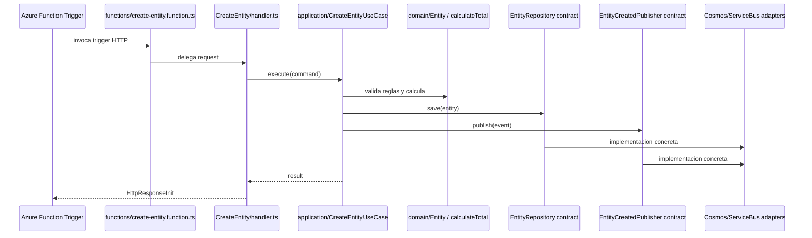

# 2. Reestructuracion hacia una arquitectura testeable

Despues de migrar a modelo v4, se puede separar responsabilidades. Esta fase busca que el codigo sea entendible, testeable y menos acoplado a Azure.

## AS IS despues de la migracion minima



## TO BE deseado



## Estructura recomendada

```text
src/
├── functions/
│   └── create-entity.function.ts
├── CreateEntity/
│   ├── api/
│   ├── application/
│   ├── domain/
│   ├── infrastructure/
│   └── handler.ts
└── shared/
    └── infrastructure/
```

## Composition root

El composition root construye dependencias reales. Aqui aparecen SDKs indirectamente por medio de adaptadores.

```ts
import crypto from "node:crypto";

import {app} from "@azure/functions";

import {CreateEntityUseCase} from "../CreateEntity/application/create-entity.use-case";
import {createCreateEntityHandler} from "../CreateEntity/handler";
import {CosmosEntityRepository} from "../CreateEntity/infrastructure/persistence/cosmos-entity.repository";
import {ServiceBusEntityCreatedPublisher} from "../CreateEntity/infrastructure/messaging/service-bus-entity-created.publisher";
import {entitiesContainer} from "../shared/infrastructure/azure/cosmos/cosmos.client";
import {entityCreatedSender} from "../shared/infrastructure/azure/service-bus/service-bus.client";

const repository = new CosmosEntityRepository(entitiesContainer);
const publisher = new ServiceBusEntityCreatedPublisher(entityCreatedSender);

const useCase = new CreateEntityUseCase({
  repository,
  publisher,
  createEntityId: () => crypto.randomUUID(),
  createRequestHash: input => crypto
    .createHash("sha256")
    .update(JSON.stringify(input))
    .digest("hex")
});

const handler = createCreateEntityHandler({
  useCase,
  now: () => new Date().toISOString()
});

app.http("CreateEntity", {
  methods: ["POST"],
  route: "entities",
  authLevel: "function",
  handler
});
```

## Handler

El handler adapta HTTP al comando del caso de uso. No conoce Cosmos ni Service Bus.

```ts
import {HttpRequest, HttpResponseInit, InvocationContext} from "@azure/functions";

import {CreateEntityCommand} from "./application/create-entity.command";
import {CreateEntityResult} from "./application/create-entity.result";
import {CreateEntityValidationError} from "./application/create-entity-validation.error";

export interface CreateEntityHandlerDependencies {
  useCase: {
    execute(command: CreateEntityCommand): Promise<CreateEntityResult>;
  };
  now: () => string;
}

interface CreateEntityHttpRequest {
  customerId?: string;
  name?: string;
  items?: Array<{ sku: string; quantity: number; unitPrice: number }>;
}

export function createCreateEntityHandler(dependencies: CreateEntityHandlerDependencies) {
  return async function (
    request: HttpRequest,
    context: InvocationContext
  ): Promise<HttpResponseInit> {
    try {
      const body = await readBody(request);
      const idempotencyKey = request.headers.get("x-idempotency-key") ?? undefined;

      const result = await dependencies.useCase.execute({
        idempotencyKey,
        customerId: body.customerId,
        name: body.name,
        items: body.items,
        requestedAt: dependencies.now()
      });

      return {
        status: result.created ? 201 : 200,
        jsonBody: result
      };
    } catch (error: unknown) {
      if (error instanceof CreateEntityValidationError) {
        return {
          status: 400,
          jsonBody: {
            code: "INVALID_REQUEST",
            message: error.message
          }
        };
      }

      context.error("Unexpected error creating entity", error);

      return {
        status: 500,
        jsonBody: {
          code: "INTERNAL_ERROR",
          message: "Unable to create entity"
        }
      };
    }
  };
}

async function readBody(request: HttpRequest): Promise<CreateEntityHttpRequest> {
  try {
    const body = await request.json();
    return typeof body === "object" && body !== null ? body as CreateEntityHttpRequest : {};
  } catch {
    return {};
  }
}
```

## Command, result y error

```ts
export interface CreateEntityCommand {
  idempotencyKey: string | undefined;
  customerId: string | undefined;
  name: string | undefined;
  items: Array<{ sku: string; quantity: number; unitPrice: number }> | undefined;
  requestedAt: string;
}

export interface CreateEntityResult {
  entityId: string;
  status: "CREATED";
  total: number;
  created: boolean;
}

export class CreateEntityValidationError extends Error {
  constructor(message: string) {
    super(message);
    this.name = "CreateEntityValidationError";
  }
}
```

## Dominio

```ts
export interface EntityItem {
  sku: string;
  quantity: number;
  unitPrice: number;
}

export function calculateTotal(items: EntityItem[]): number {
  if (!items.length) {
    throw new Error("items are required");
  }

  return items.reduce((total, item) => {
    if (!item.sku?.trim()) {
      throw new Error("sku is required");
    }

    if (item.quantity <= 0) {
      throw new Error("quantity must be greater than zero");
    }

    if (item.unitPrice < 0) {
      throw new Error("unitPrice must be greater than or equal to zero");
    }

    return total + item.quantity * item.unitPrice;
  }, 0);
}
```

```ts
export class Entity {
  private constructor(
    public readonly entityId: string,
    public readonly customerId: string,
    public readonly name: string,
    public readonly items: EntityItem[],
    public readonly total: number,
    public readonly status: "CREATED",
    public readonly createdAt: string
  ) {
  }

  static create(input: {
    entityId: string;
    customerId: string;
    name: string;
    items: EntityItem[];
    createdAt: string;
  }): Entity {
    const total = calculateTotal(input.items);

    return new Entity(
      input.entityId,
      input.customerId,
      input.name.trim(),
      input.items,
      total,
      "CREATED",
      input.createdAt
    );
  }
}
```

## Use case

```ts
import {Entity} from "../domain/entity";
import {EntityRepository} from "../domain/entity.repository";
import {EntityCreatedPublisher} from "./entity-created.publisher";
import {CreateEntityCommand} from "./create-entity.command";
import {CreateEntityResult} from "./create-entity.result";
import {CreateEntityValidationError} from "./create-entity-validation.error";

export interface CreateEntityUseCaseDependencies {
  repository: EntityRepository;
  publisher: EntityCreatedPublisher;
  createEntityId: () => string;
  createRequestHash(input: {
    customerId: string;
    name: string;
    items: Array<{ sku: string; quantity: number; unitPrice: number }>;
  }): string;
}

export class CreateEntityUseCase {
  constructor(private readonly dependencies: CreateEntityUseCaseDependencies) {
  }

  async execute(command: CreateEntityCommand): Promise<CreateEntityResult> {
    if (!command.idempotencyKey?.trim()) {
      throw new CreateEntityValidationError("idempotencyKey is required");
    }

    if (!command.customerId?.trim()) {
      throw new CreateEntityValidationError("customerId is required");
    }

    if (!command.name?.trim()) {
      throw new CreateEntityValidationError("name is required");
    }

    if (!command.items) {
      throw new CreateEntityValidationError("items are required");
    }

    const requestHash = this.dependencies.createRequestHash({
      customerId: command.customerId,
      name: command.name,
      items: command.items
    });

    const existing = await this.dependencies.repository.findByIdempotencyKey(
      command.idempotencyKey
    );

    if (existing) {
      if (existing.requestHash !== requestHash) {
        throw new CreateEntityValidationError("idempotency key conflict");
      }

      return {
        entityId: existing.entity.entityId,
        status: existing.entity.status,
        total: existing.entity.total,
        created: false
      };
    }

    const entity = Entity.create({
      entityId: this.dependencies.createEntityId(),
      customerId: command.customerId,
      name: command.name,
      items: command.items,
      createdAt: command.requestedAt
    });

    await this.dependencies.repository.save({
      entity,
      idempotencyKey: command.idempotencyKey,
      requestHash
    });

    await this.dependencies.publisher.publish({
      eventId: `${entity.entityId}:EntityCreated`,
      eventType: "EntityCreated",
      entityId: entity.entityId,
      occurredAt: command.requestedAt
    });

    return {
      entityId: entity.entityId,
      status: entity.status,
      total: entity.total,
      created: true
    };
  }
}
```

Nota: si guardar y publicar deben ser atomicos, reemplazar `save + publish` por un outbox.

## Repository y publisher contracts

```ts
import {Entity} from "./entity";

export interface EntityIdempotencyRecord {
  entity: Entity;
  requestHash: string;
}

export interface SaveEntityInput {
  entity: Entity;
  idempotencyKey: string;
  requestHash: string;
}

export interface EntityRepository {
  save(input: SaveEntityInput): Promise<void>;
  findByIdempotencyKey(idempotencyKey: string): Promise<EntityIdempotencyRecord | null>;
}
```

```ts
export interface EntityCreatedEvent {
  eventId: string;
  eventType: "EntityCreated";
  entityId: string;
  occurredAt: string;
}

export interface EntityCreatedPublisher {
  publish(event: EntityCreatedEvent): Promise<void>;
}
```

## Beneficios

- El handler se prueba sin Azure real.
- El use case se prueba sin Cosmos ni Service Bus.
- El dominio se prueba como TypeScript puro.
- Cosmos y Service Bus quedan encapsulados.
- Una futura migracion cambia adaptadores, no reglas.
