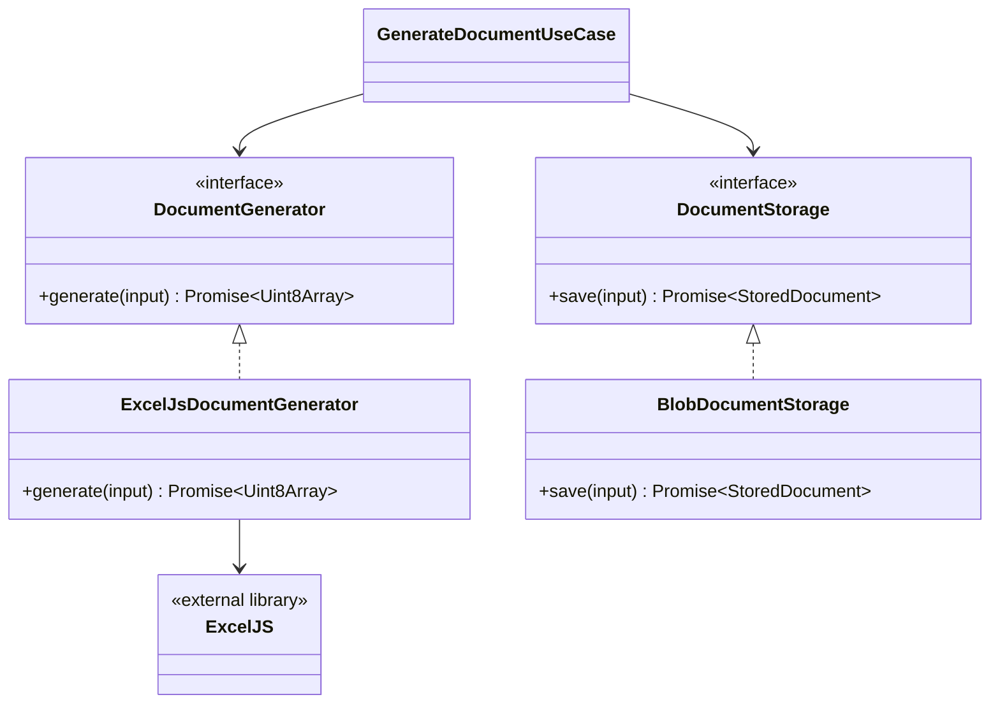

# 3. Proveedores para librerias externas

Cuando se usa una libreria externa como ExcelJS, PDFKit, Sharp, CSV parsers o clientes de terceros, no conviene llamarla directamente desde el use case ni desde el dominio.

La recomendacion es crear un contrato interno y una implementacion en infraestructura. A este adaptador se le puede llamar `provider`, `generator`, `client`, `gateway` o `adapter`, segun el caso.

## Diagrama de contratos



## Contrato interno

```ts
export interface DocumentGeneratorInput {
  entityId: string;
  title: string;
  rows: Array<{
    label: string;
    value: string | number;
  }>;
}

export interface DocumentGenerator {
  generate(input: DocumentGeneratorInput): Promise<Uint8Array>;
}
```

El contrato no menciona ExcelJS. El use case solo sabe que puede generar bytes.

## Use case desacoplado

```ts
import {DocumentGenerator} from "./document-generator";
import {DocumentStorage} from "./document-storage";

export interface GenerateDocumentUseCaseDependencies {
  generator: DocumentGenerator;
  storage: DocumentStorage;
}

export class GenerateDocumentUseCase {
  constructor(private readonly dependencies: GenerateDocumentUseCaseDependencies) {
  }

  async execute(command: {
    entityId: string;
    title: string;
    rows: Array<{ label: string; value: string | number }>;
  }): Promise<{ entityId: string; fileName: string }> {
    const content = await this.dependencies.generator.generate({
      entityId: command.entityId,
      title: command.title,
      rows: command.rows
    });

    const stored = await this.dependencies.storage.save({
      entityId: command.entityId,
      content,
      contentType: "application/vnd.openxmlformats-officedocument.spreadsheetml.sheet"
    });

    return {
      entityId: command.entityId,
      fileName: stored.fileName
    };
  }
}
```

## Provider con ExcelJS

```ts
import ExcelJS from "exceljs";

import {DocumentGenerator, DocumentGeneratorInput} from "../../application/document-generator";

export class ExcelJsDocumentGenerator implements DocumentGenerator {
  async generate(input: DocumentGeneratorInput): Promise<Uint8Array> {
    const workbook = new ExcelJS.Workbook();

    workbook.creator = "Azure Functions App";

    const worksheet = workbook.addWorksheet("Summary");

    worksheet.columns = [{
      header: "Label",
      key: "label",
      width: 30
    }, {
      header: "Value",
      key: "value",
      width: 40
    }];

    worksheet.addRow({
      label: "Entity ID",
      value: input.entityId
    });

    worksheet.addRow({
      label: "Title",
      value: input.title
    });

    for (const row of input.rows) {
      worksheet.addRow({
        label: row.label,
        value: row.value
      });
    }

    worksheet.getRow(1).font = {
      bold: true
    };

    const buffer = await workbook.xlsx.writeBuffer();

    return new Uint8Array(buffer);
  }
}
```

## Test del use case sin ExcelJS

```ts
it("should generate and store document", async () => {
  const generator = {
    generate: jest.fn().mockResolvedValue(new Uint8Array([1, 2, 3]))
  };

  const storage = {
    save: jest.fn().mockResolvedValue({
      fileName: "ENT-100.xlsx"
    })
  };

  const useCase = new GenerateDocumentUseCase({
    generator,
    storage
  });

  const result = await useCase.execute({
    entityId: "ENT-100",
    title: "Example",
    rows: [{
      label: "Total",
      value: 100
    }]
  });

  expect(generator.generate).toHaveBeenCalledTimes(1);
  expect(storage.save).toHaveBeenCalledWith(expect.objectContaining({
    entityId: "ENT-100",
    content: new Uint8Array([1, 2, 3])
  }));

  expect(result).toEqual({
    entityId: "ENT-100",
    fileName: "ENT-100.xlsx"
  });
});
```

Regla:

> Toda libreria externa debe entrar al sistema mediante un proveedor/adaptador ubicado en infraestructura.
