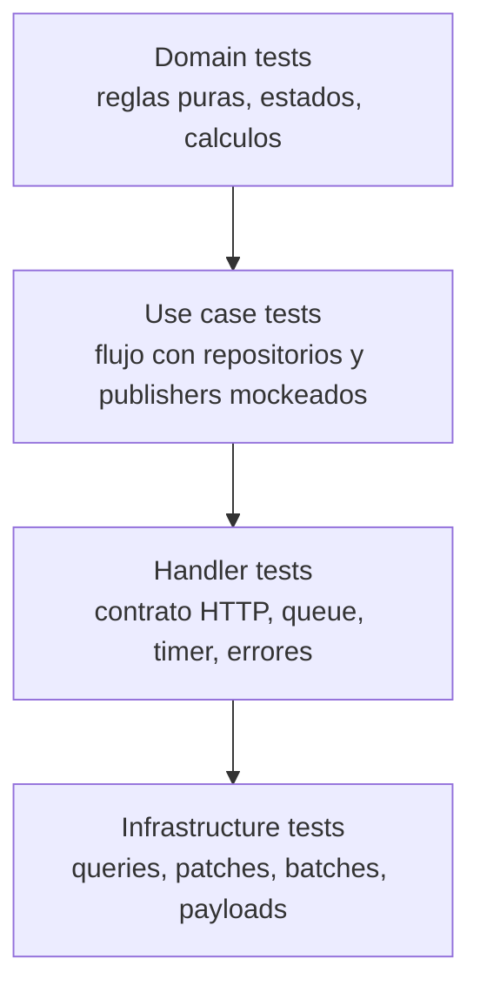
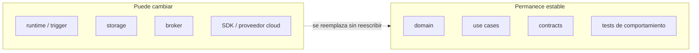

# 4. Tests, beneficios y migraciones futuras

La nueva estructura permite probar por capas y reduce el costo de migraciones futuras.

## Estrategia de tests



## Test de dominio

```ts
import {calculateTotal} from "./calculate-total";

describe("calculateTotal", () => {
  it("should calculate total", () => {
    const total = calculateTotal([{
      sku: "SKU-1",
      quantity: 2,
      unitPrice: 10
    }]);

    expect(total).toBe(20);
  });

  it("should reject invalid quantity", () => {
    expect(() => calculateTotal([{
      sku: "SKU-1",
      quantity: 0,
      unitPrice: 10
    }])).toThrow("quantity must be greater than zero");
  });
});
```

## Test de use case

```ts
import {CreateEntityUseCase} from "./create-entity.use-case";

describe("CreateEntityUseCase", () => {
  it("should create entity and publish event", async () => {
    const repository = {
      findByIdempotencyKey: jest.fn().mockResolvedValue(null),
      save: jest.fn()
    };

    const publisher = {
      publish: jest.fn()
    };

    const useCase = new CreateEntityUseCase({
      repository,
      publisher,
      createEntityId: () => "ENT-100",
      createRequestHash: () => "request-hash-100"
    });

    const result = await useCase.execute({
      idempotencyKey: "request-100",
      customerId: "CUS-100",
      name: "Example",
      items: [{
        sku: "SKU-1",
        quantity: 2,
        unitPrice: 10
      }],
      requestedAt: "2026-08-15T10:00:00.000Z"
    });

    expect(repository.save).toHaveBeenCalledTimes(1);
    expect(publisher.publish).toHaveBeenCalledTimes(1);

    expect(result).toEqual({
      entityId: "ENT-100",
      status: "CREATED",
      total: 20,
      created: true
    });
  });
});
```

## Beneficios para migraciones futuras



Escenarios:

- Azure Functions -> NestJS, Express, Fastify o containers: cambia `functions` y `handler`.
- Cosmos -> PostgreSQL, SQL Server o MongoDB: cambia `infrastructure/persistence`.
- Service Bus -> Kafka, Event Grid, RabbitMQ o SQS: cambia el publisher.
- Blob Storage -> S3 u otro storage: cambia el adaptador de storage.
- ExcelJS -> PDFKit, CSV u otra libreria: cambia el provider.
- HTTP -> queue o Durable activity: se reutiliza el mismo use case.

## Checklist de onboarding

- Donde se registra el trigger?
- Es modelo v3 o v4?
- Que entrada recibe?
- Que salida observable produce?
- Que handler ejecuta?
- Que use case llama?
- Que reglas de dominio aplica?
- Que repositorios, publishers, providers o gateways usa?
- Que variables de entorno necesita?
- Que tests documentan su comportamiento?

## Checklist de migracion y entrega

Antes de migrar:

- Identificar `function.json`.
- Identificar `index.js` o `index.ts`.
- Documentar trigger, ruta, metodo, auth y bindings.
- Documentar payloads de entrada y salida.
- Documentar variables de entorno.
- Documentar dependencias externas.

Durante v3 -> v4:

- Registrar trigger con `app.*`.
- Mantener ruta, metodo, auth, queue o schedule.
- Usar `InvocationContext`.
- Retornar `HttpResponseInit` en HTTP.
- Mantener comportamiento observable.

Durante reestructura:

- Extraer handler.
- Extraer use case.
- Extraer dominio.
- Crear repository/publisher/provider interfaces.
- Mover SDKs a infrastructure.
- Mover clientes a shared infrastructure.
- Agregar tests por capa.

Antes de entregar:

- Ejecutar typecheck.
- Ejecutar tests.
- Ejecutar build.
- Verificar que no queden bindings duplicados.
- Verificar que no se cambio funcionalidad sin aprobacion.
