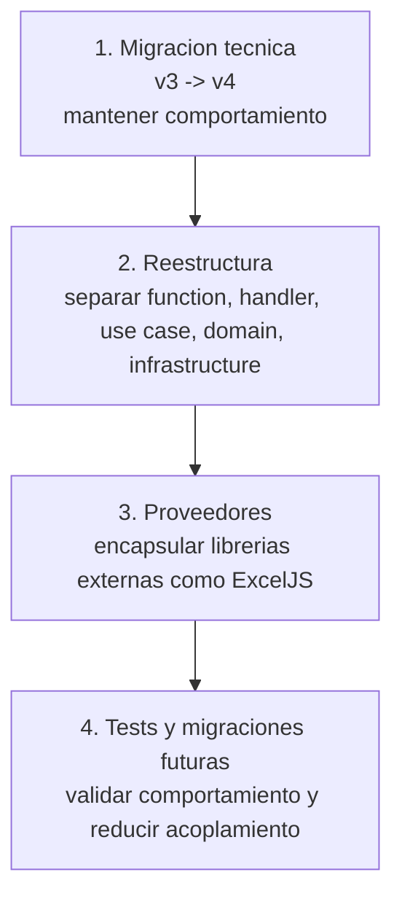
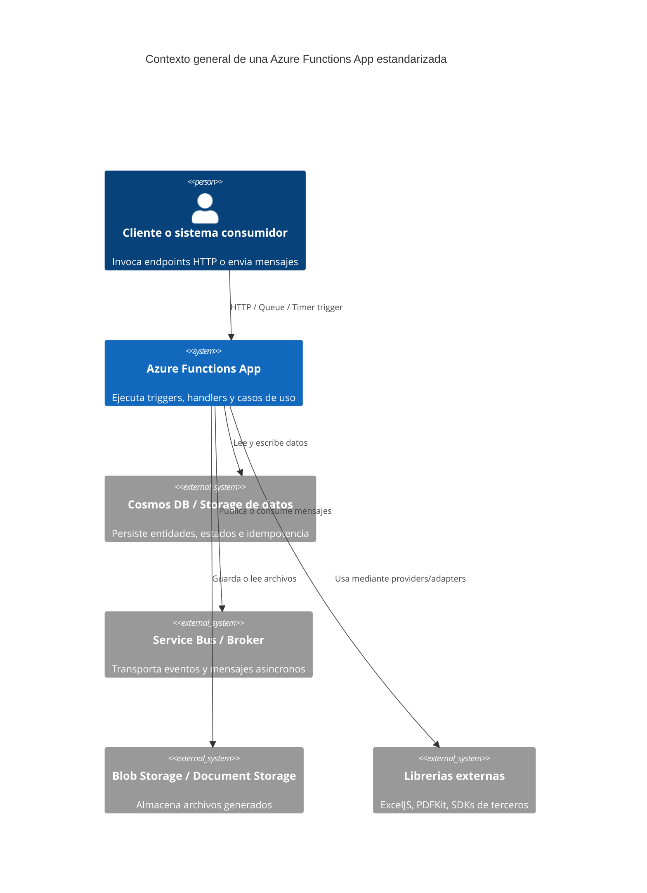
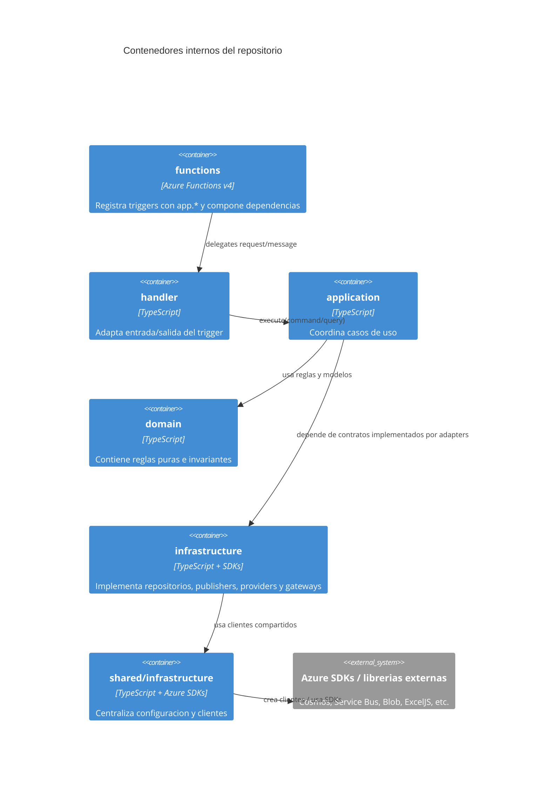
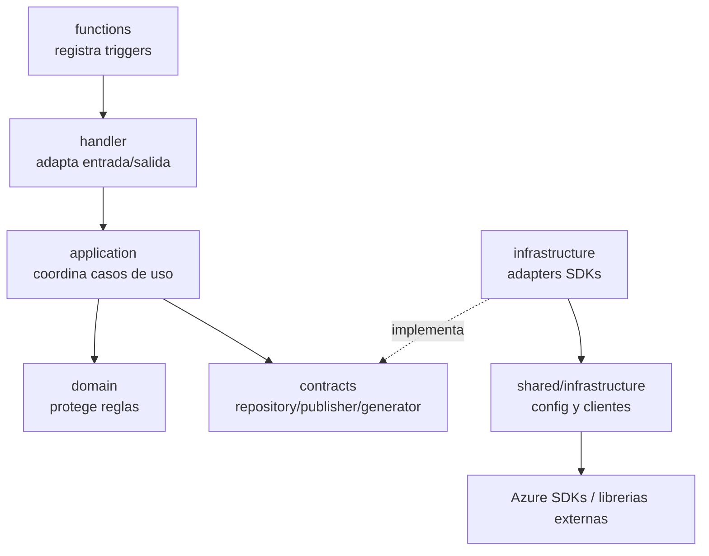

# Manual de migracion y estandarizacion para Azure Functions

Este documento es la entrada principal del manual para migrar y estandarizar repositorios de Azure Functions en Node.js/TypeScript.

La guia esta separada en archivos para que sea facil usarla en tres momentos distintos:

- Onboarding de una persona nueva.
- Migracion tecnica de Azure Functions modelo v3 a modelo v4.
- Reestructuracion de codigo legacy hacia una arquitectura testeable y preparada para cambios futuros.

La idea central es sencilla: **la Azure Function debe ser un borde de entrada, no el lugar donde vive todo el negocio**.

## Audiencia

- Desarrolladores junior que estan entrando a repositorios de Azure Functions.
- Desarrolladores que deben migrar funciones legacy de modelo v3 a modelo v4.
- Lideres tecnicos que quieren estandarizar varios repositorios.
- Equipos que mantienen funciones con logica monolitica en `index.js`, `index.ts` o en el archivo del trigger.
- Equipos que quieren mejorar testabilidad sin cambiar la funcionalidad observable.

## Ruta recomendada

El proceso completo tiene cuatro pasos. La migracion tecnica va primero; la reestructura viene despues, cuando ya sabemos que el comportamiento en modelo v4 sigue siendo el mismo.



Regla principal:

> Primero migrar sin romper. Despues reestructurar con tests.

## Decision de arquitectura

El estandar propuesto separa el sistema en capas con responsabilidades claras:

- `functions`: registra triggers y compone dependencias reales.
- `handler`: adapta HTTP, queue, timer o activity hacia comandos internos.
- `application`: coordina casos de uso.
- `domain`: protege reglas puras.
- `infrastructure`: implementa detalles tecnicos con SDKs externos.
- `shared/infrastructure`: centraliza configuracion y clientes reutilizables.

Esta separacion no busca crear carpetas por estetica. Busca que cada cambio tenga un lugar natural:

- Cambio de runtime: tocar `functions` y `handler`.
- Cambio de storage: tocar `infrastructure/persistence`.
- Cambio de broker: tocar `infrastructure/messaging`.
- Cambio de libreria como ExcelJS: tocar el provider.
- Cambio de regla: tocar `domain` y tests.

## Vista C4: Contexto

Este diagrama muestra el sistema desde afuera. Ayuda a explicar a una persona nueva que la Function App es una pieza dentro de un ecosistema con usuarios, Azure y sistemas externos.



## Vista C4: Contenedores internos

Este diagrama baja un nivel y muestra como se organiza el codigo dentro del repositorio.



## Indice

1. [Migracion de Azure Functions v3 a v4](./azure-functions-standard/01-migracion-v3-v4.md)
   - Como reconocer una funcion legacy.
   - Que identificar antes de tocar codigo.
   - Ejemplo legacy completo con `function.json` + `index.js`.
   - Migracion minima a Programming Model v4.
   - Checklist de validacion.

2. [Reestructuracion hacia una arquitectura testeable](./azure-functions-standard/02-reestructuracion-testable.md)
   - AS IS despues de migrar.
   - TO BE por capas.
   - Composition root.
   - Handler.
   - Use case.
   - Domain.
   - Repository e infrastructure.
   - Shared infrastructure.

3. [Proveedores para librerias externas](./azure-functions-standard/03-proveedores-librerias.md)
   - Concepto de proveedor/adaptador.
   - Ejemplo con ExcelJS.
   - Contratos internos.
   - Tests sin depender de la libreria real.

4. [Tests, beneficios y migraciones futuras](./azure-functions-standard/04-tests-y-migraciones-futuras.md)
   - Tests por capa.
   - Beneficios de testabilidad.
   - Migraciones futuras de runtime, storage, broker o librerias.
   - Checklist de onboarding, migracion y entrega.

## Guia rapida de lectura

| Situacion | Por donde empezar |
| --- | --- |
| El repo tiene `function.json` e `index.js` | [Migracion v3 a v4](./azure-functions-standard/01-migracion-v3-v4.md) |
| Ya usa `app.http` pero todo esta en la function | [Reestructuracion testeable](./azure-functions-standard/02-reestructuracion-testable.md) |
| Hay librerias externas como ExcelJS en el use case | [Proveedores para librerias](./azure-functions-standard/03-proveedores-librerias.md) |
| Se quiere validar calidad antes de entregar | [Tests y migraciones futuras](./azure-functions-standard/04-tests-y-migraciones-futuras.md) |
| Una persona nueva necesita entender el repo | Leer este documento y luego el checklist de onboarding |

## Estandar final esperado

```text
src/
├── functions/
├── Capability/
│   ├── api/
│   ├── application/
│   ├── domain/
│   ├── infrastructure/
│   └── handler.ts
└── shared/
    └── infrastructure/
```



## Como usar este manual

- Si el repo todavia usa `function.json`, empezar por la guia de migracion.
- Si ya esta en modelo v4 pero la logica esta mezclada, ir a la guia de reestructuracion.
- Si se usan librerias como ExcelJS, revisar proveedores.
- Antes de cerrar un cambio, revisar tests, beneficios y checklists.

## Resultado esperado

Al aplicar este manual, el equipo deberia poder:

- Migrar funciones v3 a v4 sin cambiar comportamiento.
- Separar funciones monoliticas en piezas comprensibles.
- Probar reglas y casos de uso sin levantar Azure.
- Cambiar proveedores tecnicos sin reescribir negocio.
- Hacer onboarding leyendo flujo, contratos y tests.
